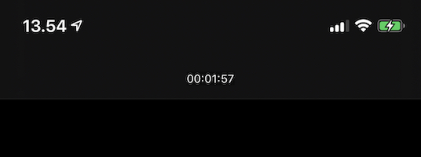

# WindowTimer
Global countdown timer for iOS to debug time sensitive events

A very basic UI component for iOS to display a global countdown timer for a specific date in the active UIWindow.

Can be useful in several situations, for example checking the expiration date of a sandbox subscription or measuring the timeout of some network calls.

It's a single file dependency, to install just copy `WindowTimer.swift` in your project. Supports iOS 9 and above.